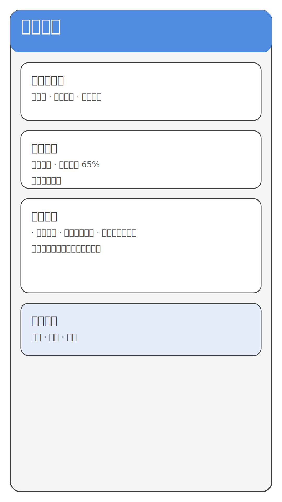
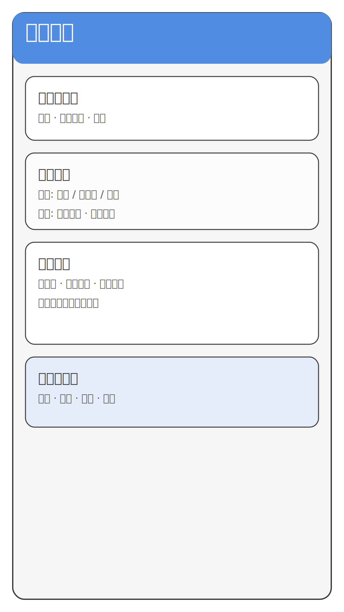
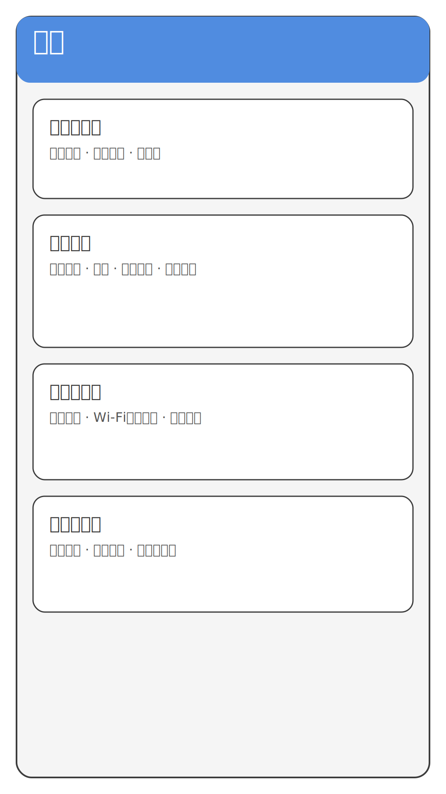
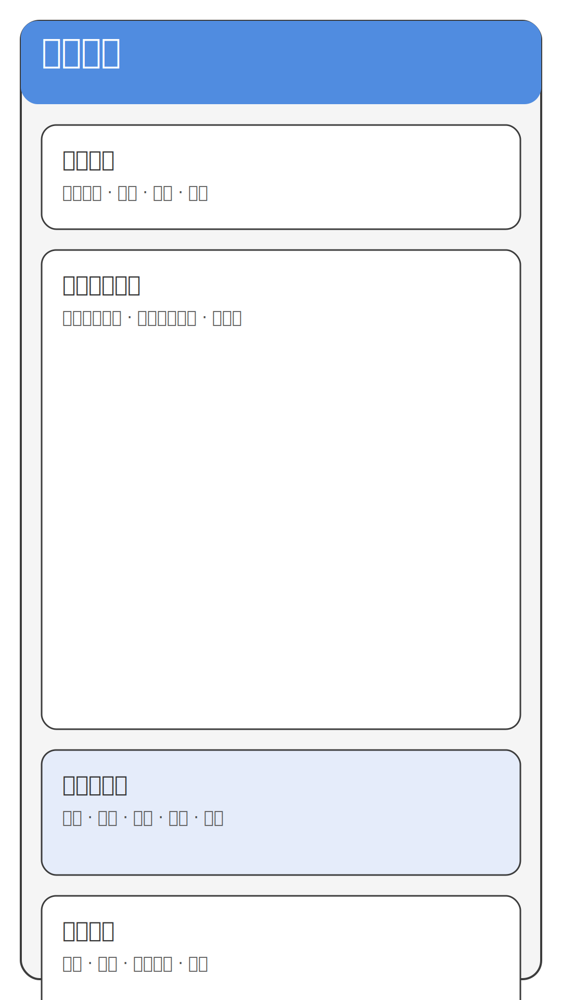

# KMP Read 主要页面UI设计

本文档描述并展示了 KMP Read 应用的四个核心页面原型。每个页面采用高对比度、清晰的分区设计，以突出阅读相关的关键操作。

## 1. 书籍列表页面
- 顶部设置搜索框与筛选、同步按钮，方便管理书籍。
- 显示正在阅读的书籍卡片，快速继续阅读。
- 主列表展示书架书籍，支持分类、最近阅读等排序。
- 底部导航切换至书源和设置页面。

## 2. 书源列表页面
- 顶部工具栏提供返回、添加书源、搜索能力。
- 书源筛选区支持按状态与排序方式筛选。
- 书源卡片呈现每个源的详细信息及可用性。
- 底部批量操作区域便于统一启用或禁用书源。

## 3. 设置页面
- 账户与同步模块管理登录与云端同步。
- 阅读体验模块覆盖字体、行距、夜间模式等。
- 下载与存储模块用于控制缓存和下载策略。
- 高级与关于模块包含调试、更新、反馈入口。

## 4. 阅读详情页面
- 顶部状态栏展示章节信息与操作按钮。
- 正文区域突出阅读内容，强调可调节排版。
- 底部控制栏整合亮度、字体、主题、进度调节。
- 阅读辅助区域提供笔记、标注、语音朗读、翻译等工具。

